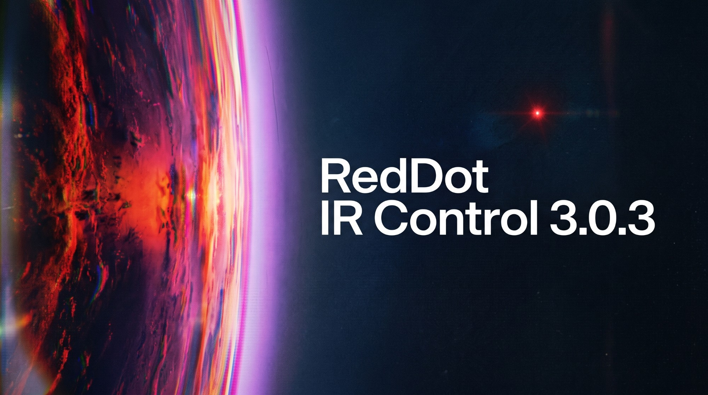

# RedDot IR Control

Программа управляет ИК-излучателями RedRat на конвейере проверки телевизоров:
записывает сигналы с пультов, складывает их в макросы и прогоняет макросы на
телевизорах — вручную кнопкой или автоматически по команде от ПЛК.

Здесь — только выпуски: что нового в каждой версии. Исходный код закрыт.

- Приборы: RedRat Pico (USB), RedRat-X по USB и по Ethernet.
- Линия: Mitsubishi FX1s (кабель USB-SC09) и Inovance (Modbus TCP по сети) —
  запуск теста по приходу паллеты, исход в контроллер.
- Работает на Windows 10/11 x64; ставит драйвер RedRat и .NET 8 сам.

Выпуски — на вкладке **Releases**.

---

(c) 2026 German Dombrovskii. All rights reserved.
